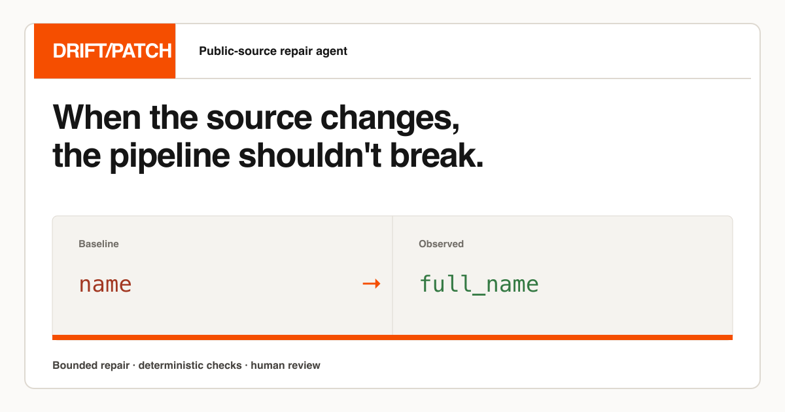
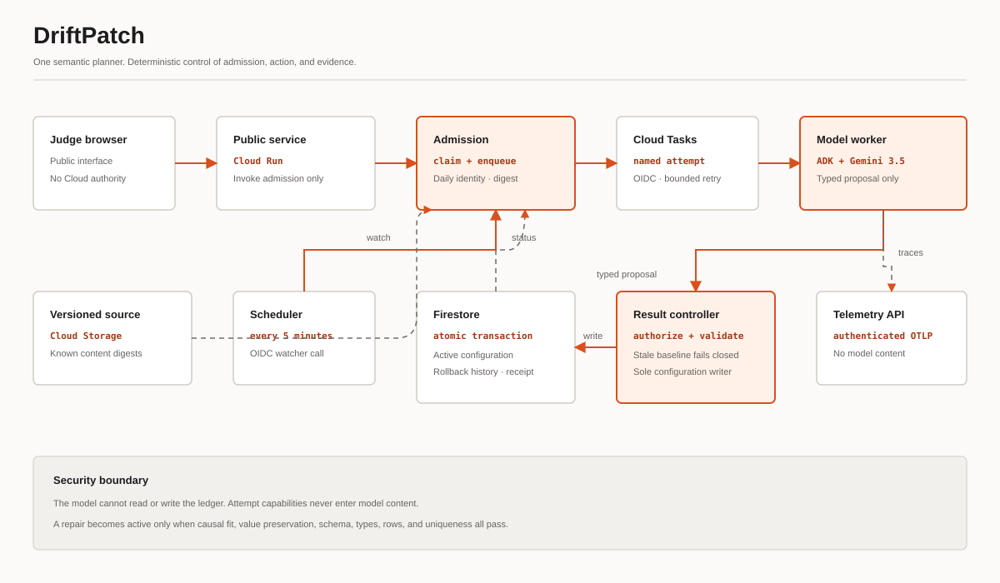

# DriftPatch

**A bounded repair agent for public-data pipeline drift.**

Public datasets change without warning: a column is renamed, a delimiter moves,
or a JSON collection is nested one level deeper. DriftPatch turns that breakage
into a proof-carrying repair proposal. It inspects the change, asks Gemini 3.5
Flash to select one typed operation, and lets deterministic data contracts decide
whether a versioned configuration can be activated.



## The decision path

```text
incident event
    -> inspect before/after source profiles
    -> choose one allowlisted repair, no change, or escalate
    -> apply the proposal in memory
    -> submit only the typed proposal to an isolated result service
    -> independently prove baseline failure, causal fit and value preservation
    -> run deterministic schema, type, row and uniqueness contracts
    -> atomically activate a versioned configuration and record its receipt
```

The model proposes; code authorizes. A fluent answer can never make a failing
contract pass.



A source rename illustrates the product boundary: DriftPatch can retarget
`name <- full_name` while preserving `name` for downstream consumers. The
receipt identifies the affected output, previous and applied configuration
hashes, version and rollback snapshot. It repairs the contract without silently
turning the new source field into a new downstream API.

## Enforced boundaries

- Exactly one typed operation from an explicit allowlist, including `no_change`.
- No arbitrary code execution, shell access or automatic merge.
- Existing output fields may be retargeted, but new facts cannot be invented.
- Unsafe or ambiguous incidents terminate as `escalated`.
- Cloud Tasks names every durable attempt separately while Firestore coalesces
  concurrent requests for the same incident and UTC day. Recovery is limited to
  two explicit dispatch attempts; status reads never start or recover work and
  cannot reset that daily budget.
- The public service has neither Firestore nor Cloud Tasks permissions; the model
  worker has no ledger permissions. Its opaque attempt and execution capabilities
  remain outside model content and state.
- The result controller checks terminal state and acquires an execution lease
  before inference, so completed or concurrent retries cannot repeat paid work.
- Only the deterministic result controller can activate configuration. It writes
  the new version, previous configuration, rollback snapshot and terminal receipt
  in one transaction; a stale baseline fails closed and an already-active repair
  does not create another version.
- A schema-valid proposal that fails the deterministic gate is retried; only five
  independently rejected proposals produce a bounded terminal failure.
- The production worker accepts only the controlled demo suite. The external
  evaluation corpus cannot be dispatched through its HTTP surface.
- A repair is successful only when the original pipeline fails, the proposed
  operation matches the observed change, declared values are preserved and
  every deterministic contract passes.
- Cloud Scheduler observes a private, versioned Cloud Storage source every five
  minutes through OIDC. The admission controller dispatches only the exact
  content digest represented by the controlled incident; an unknown mutation is
  reported as unsupported and never reaches the model.

## Reproducible evidence

The controlled benchmark contains eleven hand-checkable incidents: one compatible
change, eight safe repair patterns and two cases that must escalate. The original
ten-case trace is in
[`artifacts/traces/full_benchmark.json`](artifacts/traces/full_benchmark.json),
and the final deterministic grade is in
[`artifacts/grade_results/final_10_deterministic/results_20260812_115831.json`](artifacts/grade_results/final_10_deterministic/results_20260812_115831.json).

The independent corpus adds six observed historical transitions from four
publishers. Every source is pinned by commit and SHA-256; four cases were frozen
as a holdout before inference. The official deterministic grade is 4/4 with a
mean of 1.0000 and zero deviation. Its JSON artifact is at
[`artifacts/grade_results/external-holdout-round-001/results_20260812_173918.json`](artifacts/grade_results/external-holdout-round-001/results_20260812_173918.json).
This is evidence for the bounded task, not a universal reliability claim.

## Run locally

Requirements: Python 3.11–3.13, [uv](https://docs.astral.sh/uv/), Node.js 20+
and a Gemini API key for the local decision path.

```bash
cp .env.example .env
# Add GEMINI_API_KEY to the ignored .env file.
uv sync --extra lint
cd frontend && npm ci && npm run build && cd ..
uv run uvicorn app.fast_api_app:app --host 127.0.0.1 --port 8000
```

Open `http://127.0.0.1:8000`, choose an incident, and run the complete live
decision path. Credentials stay in the ignored `.env` file.

## Verify

```bash
uv run ruff check app tests
uv run pytest tests/unit tests/integration -q
cd frontend && npm test -- --run && npm run build
```

## Deploy

The release module owns a dedicated project, immutable Artifact
Registry repository, four Cloud Run services, Firestore database, Cloud Tasks
queue, scheduled private source and a project-scoped €10 gross-usage alert
budget. The budget excludes credits so alerts track actual consumption; it is
not represented as a hard spending cap.

Bootstrap the project, APIs and image repository before the first image exists:

```bash
export TF_VAR_project_id=driftpatch-<release-id>
export TF_VAR_billing_account_id=<billing-account-id>
export TF_VAR_image=example.invalid/driftpatch@sha256:0000000000000000000000000000000000000000000000000000000000000000

terraform -chdir=deployment/terraform/single-project init
# Only when adopting an existing, verified-empty project:
# terraform -chdir=deployment/terraform/single-project import google_project.release "$TF_VAR_project_id"
terraform -chdir=deployment/terraform/single-project apply \
  -target=google_project.release \
  -target=google_project_service.required \
  -target=google_artifact_registry_repository.images
```

Build once in Cloud Build, resolve the uploaded digest and apply the complete
plan with that immutable reference:

```bash
COMMIT=$(git rev-parse HEAD)
REPOSITORY=europe-west1-docker.pkg.dev/${TF_VAR_project_id}/driftpatch/app
gcloud builds submit --project "${TF_VAR_project_id}" --region europe-west1 \
  --config cloudbuild.yaml \
  --substitutions "_IMAGE=${REPOSITORY}:${COMMIT},_AGENT_VERSION=${COMMIT}" .
gcloud artifacts docker images list "${REPOSITORY}" \
  --project "${TF_VAR_project_id}" --include-tags \
  --filter="tags:${COMMIT}" --format='value(version)'

export TF_VAR_image=${REPOSITORY}@sha256:<reported-digest>
terraform -chdir=deployment/terraform/single-project plan \
  -out=/tmp/driftpatch-release.tfplan
terraform -chdir=deployment/terraform/single-project apply \
  /tmp/driftpatch-release.tfplan
```

Do not commit the billing identifier, Terraform state or plan. A release is not
complete until the public route, private IAM denials, scheduled OIDC event,
idempotent duplicate, Firestore receipt and Cloud Trace span are observed.

## Scheduled source proof

The release module initializes a private live source with the compatible
baseline. After deployment, advance that source without calling the agent:

```bash
uv run python scripts/set_live_source.py drift --project <dedicated-project-id>
```

Within five minutes, Cloud Scheduler invokes the authenticated watcher. The
watcher hashes the observed bytes, admits the matching incident once for the UTC
day, and records both `trigger: cloud-scheduler` and the source SHA-256 in the
terminal receipt. Reset the source with the same command using `baseline`.
This scheduled path demonstrates ambient detection; the historical holdout
remains separate evidence that the bounded decision policy generalizes beyond
the controlled live source.

## Architecture status

Local development uses the Agent Development Kit, FastAPI and an in-memory
evidence ledger behind the same bounded public routes. The production code and
Terraform define four separately identified Cloud Run services in
`europe-west1`:

1. the public proof interface, with no database, queue or model authority;
2. a private admission controller that coalesces one incident per UTC day,
   reads only the dedicated source object and alone can enqueue the named task;
3. an internal model worker that can invoke Vertex AI and submit only a typed
   proposal; and
4. a private deterministic result controller that re-applies authorization and
   contracts before it alone commits the versioned configuration, rollback
   snapshot and terminal evidence.

Cloud Tasks invokes the worker through OIDC and limits dispatch rate and
concurrency. The result controller binds every commit to the active execution
capability; completed retries stop before inference, and expired admissions
recover only through another idempotent run request with a new task identity.
Cloud Scheduler invokes the admission watcher through a separate least-privilege
identity. The source bucket prevents public access, retains object versions and
grants read access only to admission; the public and model services cannot read
it. A stable digest costs no model call, while an unrecognized digest fails
closed.
The active configuration, its per-event history and the terminal result are
committed atomically in Firestore. Firestore capabilities are never sent to the
model, and model prose or confidence is not trusted as public evidence.
The bounded worker exports authenticated OpenTelemetry spans directly to the
Google Cloud Telemetry API with model-content capture disabled; the public
service has no trace-writer authority.
Cloud Tasks is not available in Madrid;
Belgium is the nearest supported region and keeps the release co-located.
These resources remain deployment-ready code, not a claim of current public
availability. The Terraform module creates or explicitly adopts one dedicated
Google Cloud project with no default network and deletion prevention; it does
not attach these runtime identities to a shared project. Conditional IAM further
limits both ledger controllers to the named Firestore database.

## Provenance

Work on DriftPatch began on 12 August 2026 for the All Things Agentic contest.
The initial project layout was generated with Google's Agents CLI; the agent
workflow, bounded repair domain, benchmark, interface and evidence were created
during the contest period. Development was AI-assisted.

## License

Apache License 2.0. See [`LICENSE`](LICENSE).
